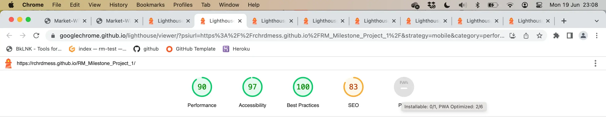
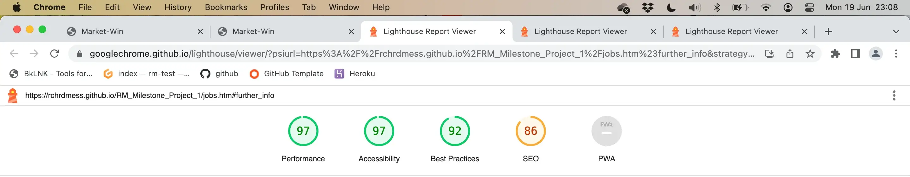
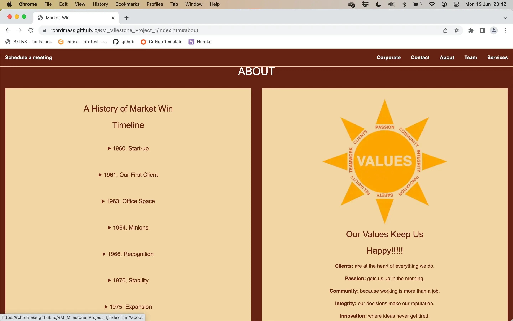

# Market-Win, Milestone Project 1

(Developer: Richard Messenger)

[Live webpage](https://rchrdmess.github.io/RM_Milestone_Project_1/)

Market-Win is the brand new website for the digital marketing company of the same name.

The website is designed to be accessible and work across all devices, allowing clear comunication of the company's history, people and services, and enable users to approach the company regarding their services.

## Contents

1. [Project Goals](#project-goals)
    1. [User Goals](#user-goals)
    2. [Site Owner Goals](#site-owner-goals)
    3. [Developer Goals](#developer-goals)
2. [User Experience](#user-experience)
    1. [Target Audience](#target-audience)
    2. [User Requirements and Expectations](#user-requirements-and-expectations)
    3. [User Stories](#user-stories)
3. [Design](#design)
    1. [Design Choices](#design-choices)
    2. [Colours](#colours)
    3. [Fonts](#fonts)
    4. [Structure](#structure)
    5. [Wireframes](#wireframes)
4. [Technologies Used](#technologies-used)
    1. [Languages](#languages)
    2. [Frameworks and Tools](#frameworks-and-tools)
5. [Features](#features)
6. [Testing](#testing)
    1. [HTML Validation](#HTML-validation)
    2. [CSS Validation](#CSS-validation)
    3. [Accessibility](#accessibility)
    4. [Performance](#performance)
    5. [Device testing](#performing-tests-on-various-devices)
    6. [Browser compatibility](#browser-compatibility)
    7. [Testing user stories](#testing-user-stories)
8. [Bugs](#bugs)
9. [Deployment](#deployment)
10. [Credits](#credits)
11. [Acknowledgements](#acknowledgements)

## Project Goals

The key goal is to convey the company's experience and ethos through a straight-forward website. In doing so, it will encourage those looking for marketing services to contact the company, an action which can be achieved on every page via the 'Shedule a meet' button in the top left corner.  It should be easy to navigate and feature corporate information such as Ts&Cs, a jobs board and press releases.

### User Goals

- An easy to navigate website
- Presented with a view to accessibility issues
- Provide a clear action throughwhich to contact the company
- Convey the company's depth of experience, success and approachability through tone
- Provide all the information a user could require in deciding whether to request the company's services
- Assistance in identifying their needs

### Site Owner Goals

- Promote the business
- Increase the client base
- Provide comprehensive company information
- Encourage uptake of the company's digital marketing services
- Communicate the company's pedigree
- Separate key information from general corporate information
- Provide a tool to filter service requests

### Developer Goals

- To convey all the key information in sections on a single page
- To allow the sub-sections to stack vertically on smaller devices
- Easy navigation
- Clear colour contrast for visually impaired users

## User Experience

### Target Audience

- Working professionals
- Self-employed or corporate
- Anyone with a marketing/PR requirement

### User Requirements and Expectations

- Reliable, consistent navigation
- No dead links
- Clear presentation across all devices
- Accessibility
- Not text heavy
- A clear understanding of Market-Win

### User Stories

#### First Visit

- What does Market-Win do
- Who is in the Market-Win team
- How to contact Market-Win
- Could Market-Win provide a good service
- Is Market-Win on social media
- Could I work for Market-Win

#### Repeat visit

- Can I find more detailed information
- What are the terms of service
- Will any data I provide be safe

#### Site Owner

- I want to promote the business
- I want to increase our client base
- I want to make our information readily available
- I want to let people know who we are
- I want to let people know our track record
- I want to encourage people to contact us

## Design

### Design Choices

A varying grid style layout has been chosen on the main page. Here, information is provided succinctly, with the user given the option to find out more, or "explore", through summary tags, if they choose to. More detailed information is cataglogued in the corporate section, reached via the footer on all pages.

### Colours

When choosing colours, the focus is on accessibility. A number of combinations were tested using a [contrast checker](https://www.siegemedia.com/contrast-ratio) to make sure a score above 4.5 was achieved for text contrasts. Ideally, we aimed for 7.

The scheme chosen was 'chocolate and coffee' as these are every marketeer's favourite foods. 

- Background: chocolate, #662211
- Navigation text: white, #ffffff
- Navigation bar: chocolate, #662211
- Section divisions: coffee, #f1d6a3
- Section text: brown, #662211
- Corporate pages menu: coffee, #f1d6a3
- Corporate pages menu text: brown, #662211

#### Text Ratios

Navigation bar (chocolate and white): 11.65
Sections ratio (chocolate and coffee): 8.26

### Fonts

Keeping with the desire for accessibility, sans-serif fonts were used as these are generally considered better for use on screens. Standard font families: helvetica, avenir, verdana and arial were chosen to maintain consistency across all browsers.

### Structure

The main index page is structured in sections placed in an ordered manner.

The navigation bar and footer are consistent across all pages. 

A ‘Request a meet’ modal is accessible in the top left hand corner of each page.

The website consists of eight separate pages:

##### Main Page
 
- index.htm: this is the main page containing all the company's key information arranged into sections. Each section can be navigated to via the links in the navigation bar at the top of each page.

#### Corporate Pages

- faqs.htm: A page containing answers to common questions the user might ask.
- reviews.htm: A page containing reviews from existing customers.
- jobs.htm: A page containing information on the latest vacancies.
- press.htm: A page containing press releases.
- privacy.htm: A page containing the privasy statement/policy.
- ua.htm: A page containing the user agreement.

#### 404 Page

- 404.htm: A page containing a redirect link should the incorrect address be typed.

### Wireframes

## Technologies

### Languages

- [HTML](https://en.wikipedia.org/wiki/HTML)
- [CSS](https://en.wikipedia.org/wiki/CSS)
- [Javascript](https://en.wikipedia.org/wiki/JavaScript)

### Frameworks and Tools

- [Git](https://git-scm.com/)
- [Github](https://github.com/)
- [Balsamiq](https://balsamiq.com/wireframes/)
- [Adobe Suite (Illustrator, Photoshop & InDesign)](https://www.adobe.com/uk/)
- [Font Awesome](https://fontawesome.com/search)
- [Favicon](https://iconifier.net)  
- [W3C validator](https://validator.w3.org/)
- [Jigsaw CSS validator](https://jigsaw.w3.org/css-validator/)
- [Microsoft Office Powerpoint](https://www.office.com)
- [EZ Gif](https://ezgif.com/maker)
- [Text Editor](https://support.apple.com/en-gb/guide/textedit/welcome/mac)
- [Google Chrome](https://www.google.com/chrome/)
- [Apple Voice Over](https://support.apple.com/en-gb/guide/iphone/iph3e2e415f/ios)

## Features

- Navigation Bar
  - Sticking to the top of every page, the navigation bar contains links to all the sections on the main page, plus a link to book a meeting with the company.
  - It is the same on every page.
  - It works across various screen sizes, allowing for easy navigation without the need of the back button

[Services](index.htm#services)  
[Team](index.htm#team)  
[About](index.htm#about)  
[Contact](index.htm#contact)  
[Coporate](index.htm#corporate)  

- Home section
  - The first section directly beneath the navigation bar features Market-Win's logo and slogan.
  - It is designed to convey a professional, approachable and successful view of the company.

  
Turn your marketing into a *market win*.

- Services Section
  - The services section details the three main services the company is promoting through the new website.
  - Users will be shown a pictorial representation of each service.
  - A short paragraph will succinctly convey Market-Win's expertise.

  
#### Social Media
No matter how you choose to connect with your customer base, we boast in-house experts for every social media platform, meaning we can get you engaged across the digital landscape.

  
#### S.E.O.
In this day and age, if you're not visible online, you may as well not exist. The more web traffic you drive to your website, the more leads you gain and the greater your chances of generating business.

  
#### Content Marketing
With a glowing social media presence and a sturdy backend to your website, now all you need is content. Be it images, videos or blog posts, we've got the skills to engage your customers with strategic campaigns.

- Team Section
  - The team section introduces Market-Win's leadership team, providing a profile picture, job title, brief bio and key skills of each.
  - The tone of this section conveys the companies personality.
  - Key skills are communicated via an animation titled: Superpowers.

  
**Mary's Job Title**   
**Mary's Bio**  
**Mary's Superpowers**

  
**Joseph's Job Title**   
**Joseph's Bio**  
**Joseph's Superpowers**

  
**Mo's Job Title**   
**Mo's Bio**  
**Mo's Superpowers**

  
**Pauline's Job Title**   
**Pauline's Bio**  
**Pauline's Superpowers**

  
**Peter's Job Title**   
**Peter's Bio**  
**Peter's Superpowers**

- About Section
  - The about section uses two articles to detail the company's history and values.
  - Market-Win's history is communicated via a timeline and illustrated with pictures representing the key milestones.
    - Summary and detail attributes are used to present the information cleanly.
  - A graphical display illustrated Market-Win's core values, which are then listed and detailed below.

#### A History of Market-Win
 
**1960, Start-up**  
  
**1961, Our First Client**  
  
**1963, Office Space**  
 
**1964, Minions**  

**1966, Recognition**  

**1970, Stability**  
 
**1975, Expansion**  

**1985, Inventing the Yuppie**  

**2000s, Domination**  

 #### Our Values Keep Us Happy
  
**Clients:** are at the heart of everything we do.  
**Passion:** gets us up in the morning.  
**Community:** because working is more than a job.  
**Integrity:** our decisions make our reputation.  
**Innovation:** where ideas never get tired.  
**Safety:** practices that put wellbeing first.  
**Reliability:** we're as good as our word.  
**Teamwork:** makes us stronger.  

- Contact Section
  - The contact section features a map as well as Market-Win's address, phone and email.
  - To help SEO, the address tag is used.
  - Email is provided as a mailto link.

- Footer Section
  - The footer contains Market-Win's logo, corporate pages and social media links.
  - Social media pages open in a new window.
  - Pages are listed in two sections for easy navigation.
  - Each page listed in the footer is sepatate from the main page.
  - The footer is the same on every page and is colour coordinated with the top navigation bar for a visual link.
  - Pages:
    - FAQ
    - Client Reviews
    - Jobs
    - Press Releases
    - User Agreement
    - Privacy Statement
- 404:
    - Contains a conveniently located button to help the user return to the main page.

### Future Features To Implement

- Client Login
- Jobs Portal

## Testing

All functions work as intended. There are no dead or erroneous links.

When viewed on smaller screens, the sub-sections of the main page stack vertically instead of horizontally. The order of each main section stays vertical and in the same order.

The website was navigated using Apple's Voice Over and aria labels were added to provide a coherent narrative to visually impaired users.

The web form passed when run through Code Institutes form tester:

On deploying to GitHub, some alignment issues were noted when viewed on a phone for the first time and adjusted acordingly using Google Chrome's inspect feature. (See 'Bugs' below)

### HTML Validation

The W3C Markup Validation Service passed all pages with no errors.

index.htm [results](https://validator.w3.org/nu/?doc=https%3A%2F%2Frchrdmess.github.io%2FRM_Milestone_Project_1%2F)

faqs.htm [results](https://validator.w3.org/nu/?doc=https%3A%2F%2Frchrdmess.github.io%2FRM_Milestone_Project_1%2Ffaqs.htm) 

jobs.htm [results](https://validator.w3.org/nu/?doc=https%3A%2F%2Frchrdmess.github.io%2FRM_Milestone_Project_1%2Fjobs.htm) 

press.htm [results](https://validator.w3.org/nu/?doc=https%3A%2F%2Frchrdmess.github.io%2FRM_Milestone_Project_1%2Fpress.htm) 

privacy.htm [results](https://validator.w3.org/nu/?doc=https%3A%2F%2Frchrdmess.github.io%2FRM_Milestone_Project_1%2Fprivacy.htm) 

reviews.htm [results](https://validator.w3.org/nu/?doc=https%3A%2F%2Frchrdmess.github.io%2FRM_Milestone_Project_1%2Freviews.htm) 

user_agreement.htm [results](https://validator.w3.org/nu/?doc=https%3A%2F%2Frchrdmess.github.io%2FRM_Milestone_Project_1%2Fua.htm) 

404.htm [results](https://validator.w3.org/nu/?doc=https%3A%2F%2Frchrdmess.github.io%2FRM_Milestone_Project_1%2F404.htm) 

### CSS Validation

The W3C Jigsaw CSS Validation Service passed the stylesheet with no errors.

style.css [results](https://jigsaw.w3.org/css-validator/validator?uri=https%3A%2F%2Frchrdmess.github.io%2FRM_Milestone_Project_1&profile=css3svg&usermedium=all&warning=1&vextwarning=&lang=en)  

### Accessibility

Accessibility testing returns two errors:

1. Notes an empty link on an element that is hidden, which the developer has discounted as irrelevant because no user is able to view it at teh intention of the developer.

2. Notes a missing form label in the modal window. The developer is unable to identify these as the modal window cant be loaded on screen for the software tool to highlight what it is specifically referring to. As a result, the modal has been re-tested using the Voice Over utility and no apparent errors exist. All elements are described by Voice Over as intended.

index.htm [results](https://wave.webaim.org/report#/https://rchrdmess.github.io/RM_Milestone_Project_1/)

faqs.htm [results](https://wave.webaim.org/report#/https://rchrdmess.github.io/RM_Milestone_Project_1/faqs.htm) 

jobs.htm [results](https://wave.webaim.org/report#/https://rchrdmess.github.io/RM_Milestone_Project_1/jobs.htm) 

press.htm [results](https://wave.webaim.org/report#/https://rchrdmess.github.io/RM_Milestone_Project_1/press.htm) 

privacy.htm [results](https://wave.webaim.org/report#/https://rchrdmess.github.io/RM_Milestone_Project_1/privacy.htm) 

reviews.htm [results](https://wave.webaim.org/report#/https://rchrdmess.github.io/RM_Milestone_Project_1/reviews.htm) 

user_agreement.htm [results](https://wave.webaim.org/report#/https://rchrdmess.github.io/RM_Milestone_Project_1/user_agreement.htm) 

404.htm [results](https://wave.webaim.org/report#/https://rchrdmess.github.io/RM_Milestone_Project_1/404.htm) 

### Performance

Running the main page through Google Lighthouse returns acceptable results.

index.htm [results](https://googlechrome.github.io/lighthouse/viewer/?psiurl=https%3A%2F%2Frchrdmess.github.io%2FRM_Milestone_Project_1%2Findex.htm%23services&strategy=mobile&category=performance&category=accessibility&category=best-practices&category=seo&category=pwa&utm_source=lh-chrome-ext)

faqs.htm [results](https://googlechrome.github.io/lighthouse/viewer/?psiurl=https%3A%2F%2Frchrdmess.github.io%2FRM_Milestone_Project_1%2Ffaqs.htm&strategy=mobile&category=performance&category=accessibility&category=best-practices&category=seo&category=pwa&utm_source=lh-chrome-ext) 

jobs.htm [results](https://googlechrome.github.io/lighthouse/viewer/?psiurl=https%3A%2F%2Frchrdmess.github.io%2FRM_Milestone_Project_1%2Fjobs.htm&strategy=mobile&category=performance&category=accessibility&category=best-practices&category=seo&category=pwa&utm_source=lh-chrome-ext) 

press.htm [results](https://googlechrome.github.io/lighthouse/viewer/?psiurl=https%3A%2F%2Frchrdmess.github.io%2FRM_Milestone_Project_1%2Fpress.htm&strategy=mobile&category=performance&category=accessibility&category=best-practices&category=seo&category=pwa&utm_source=lh-chrome-ext)  

privacy.htm [results](https://googlechrome.github.io/lighthouse/viewer/?psiurl=https%3A%2F%2Frchrdmess.github.io%2FRM_Milestone_Project_1%2Fprivacy.htm&strategy=mobile&category=performance&category=accessibility&category=best-practices&category=seo&category=pwa&utm_source=lh-chrome-ext)  

reviews.htm [results](https://googlechrome.github.io/lighthouse/viewer/?psiurl=https%3A%2F%2Frchrdmess.github.io%2FRM_Milestone_Project_1%2Freviews.htm&strategy=mobile&category=performance&category=accessibility&category=best-practices&category=seo&category=pwa&utm_source=lh-chrome-ext) 

user_agreement.htm [results](https://googlechrome.github.io/lighthouse/viewer/?psiurl=https%3A%2F%2Frchrdmess.github.io%2FRM_Milestone_Project_1%2Fua.htm&strategy=mobile&category=performance&category=accessibility&category=best-practices&category=seo&category=pwa&utm_source=lh-chrome-ext)  

404.htm [results](https://googlechrome.github.io/lighthouse/viewer/?psiurl=https%3A%2F%2Frchrdmess.github.io%2FRM_Milestone_Project_1%2F404.htm&strategy=mobile&category=performance&category=accessibility&category=best-practices&category=seo&category=pwa&utm_source=lh-chrome-ext) 

### Device testing

The website was tested on the following devices:
- MacBook Air
- iPad Mini
- iPhone XR

The website was tested using Google Chrome Developer Tools for a selection of popular devices across several manufacturers.

### Browser compatibility

The website was tested on the following browsers:
- Apple Safari
- Google Chrome

### Testing user stories

#### First Time Users

1. What does Market-Win do

| **Feature** | **Action** | **Expected Result** | **Actual Result** |
|-------------|------------|---------------------|-------------------|
| Main Page | On Index page scroll down | Information is provided | Works as intended |
| Footer - corporate information section | On any page view the footer | View the FAQ page via link | Works as intended |
| Navigation Bar | On any page click 'Corporate' in the navigation bar | Information is provided | Works as intended |

2. Who is in the Market-Win team

| **Feature** | **Action** | **Expected Result** | **Actual Result** |
|-------------|------------|---------------------|-------------------|
| Main Page | On Index scroll down to team section | Information is provided | Works as intended |
| Navigation Bar | On any page click 'Team' in the navigation bar | Information is provided | Works as intended |

3. How to contact Market-Win

| **Feature** | **Action** | **Expected Result** | **Actual Result** |
|-------------|------------|---------------------|-------------------|
| Main Page | On Index scroll down to contact section | Information is provided | Works as intended |
| Navigation Bar | On any page click 'Contact' in the navigation bar | Information is provided | Works as intended |
| Navigation Bar | On any page click 'Schedule A meeting' in the navigation bar | Information is provided | Works as intended |

4. Could Market-Win provide a good service

| **Feature** | **Action** | **Expected Result** | **Actual Result** |
|-------------|------------|---------------------|-------------------|
| Main Page | On Index scroll down to About section | Information is provided | Works as intended |
| Navigation Bar | On any page click 'About' in the navigation bar | Information is provided | Works as intended |
| Navigation Bar | On any page click 'Corporate' in the navigation bar | Information is provided | Works as intended |
| Corporate Pages | On any page click 'Reviews' in the footer | Information is provided | Works as intended |

5. Is Market-Win on social media

| **Feature** | **Action** | **Expected Result** | **Actual Result** |
|-------------|------------|---------------------|-------------------|
| All Pages | Scroll down to footer | Information is provided | Works as intended |
| Navigation Bar | On any page click 'Corporate' in the navigation bar | Information is provided | Works as intended |

6. Could I work for Market-Win

| **Feature** | **Action** | **Expected Result** | **Actual Result** |
|-------------|------------|---------------------|-------------------|
| Footer - corporate information section | On any page view the footer | Click the Jobs page | Works as intended |
| Navigation Bar | On any page click 'Corporate' in the navigation bar | Information is provided via link | Works as intended |
| FAQ Page | On FAQs page click 'Jobs Board' in the third item | Information is provided via link | Works as intended |

#### Repeat Visit

7. Can I find more detailed information

| **Feature** | **Action** | **Expected Result** | **Actual Result** |
|-------------|------------|---------------------|-------------------|
| Footer - corporate information section | On any page view the footer | View the pages via the links | Works as intended |
| Navigation Bar | On any page click 'Corporate' in the navigation bar | Information is provided | Works as intended |

8. What are the terms of service

| **Feature** | **Action** | **Expected Result** | **Actual Result** |
|-------------|------------|---------------------|-------------------|
| Footer - corporate information section | On any page view the footer | View the Privacy and User Agreement pages via the links | Works as intended |
| Navigation Bar | On any page click 'Corporate' in the navigation bar | Information is provided via links | Works as intended |

9. Will any data I provide be safe

| **Feature** | **Action** | **Expected Result** | **Actual Result** |
|-------------|------------|---------------------|-------------------|
| Footer - corporate information section | On any page view the footer | View the User Agreement page via the links | Works as intended |
| Navigation Bar | On any page click 'Corporate' in the navigation bar | Information is provided via links | Works as intended |

#### Site Owner 

10. I want to promote the business

| **Feature** | **Action** | **Expected Result** | **Actual Result** |
|-------------|------------|---------------------|-------------------|
| Main Page | On Index page scroll down | Information is provided | Works as intended |
| Navigation Bar | On any page click 'Schedule a meet' | Find booking form on Modal | Works as intended |
| Navigation Bar | On any page click 'About' in the navigation bar | Information is provided | Works as intended |
| Navigation Bar | On any page click 'Corporate' in the navigation bar | Information is provided | Works as intended |
| Navigation Bar | On any page click 'Team' in the navigation bar | Information is provided | Works as intended |
| Navigation Bar | On any page click 'Services' in the navigation bar | Information is provided | Works as intended |
| Corporate Pages | On any page click 'Reviews' in the footer | Information is provided | Works as intended |
| Navigation Bar | On any page click 'Contact' in the navigation bar | Information is provided | Works as intended |

11. I want to increase our client base

| **Feature** | **Action** | **Expected Result** | **Actual Result** |
|-------------|------------|---------------------|-------------------|
| Navigation Bar | On any page click 'Schedule a meet' | Find booking form on Modal | Works as intended |
| Main Page | On Index scroll down to contact section | Information is provided | Works as intended |
| Navigation Bar | On any page click 'Contact' in the navigation bar | Information is provided | Works as intended |
| Main Page | On Index scroll down to contact section | Information is provided | Works as intended |

12. I want to make our information readily available

| **Feature** | **Action** | **Expected Result** | **Actual Result** |
|-------------|------------|---------------------|-------------------|
| Main Page | On Index scroll down to contact section | Information is provided | Works as intended |
| Navigation Bar | On any page click 'About' in the navigation bar | Information is provided | Works as intended |
| Header Meta Data | Information provided to search engines | Information is provided | Works as intended |

13. I want to let people know who we are

| **Feature** | **Action** | **Expected Result** | **Actual Result** |
|-------------|------------|---------------------|-------------------|
| Main Page | On Index page scroll down | Information is provided | Works as intended |
| Navigation Bar | On any page click 'Team' in the navigation bar | Information is provided | Works as intended |
| All Pages | Scroll down to footer | Information is provided | Works as intended |

14. I want to let people know our track record

| **Feature** | **Action** | **Expected Result** | **Actual Result** |
|-------------|------------|---------------------|-------------------|
| Main Page | On Index scroll down to About section | Information is provided | Works as intended |
| Navigation Bar | On any page click 'About' in the navigation bar | Information is provided | Works as intended |
| Navigation Bar | On any page click 'Corporate' in the navigation bar | Information is provided | Works as intended |
| Corporate Pages | On any page click 'Reviews' in the footer | Information is provided | Works as intended |

15. I want to encourage people to contact us

| **Feature** | **Action** | **Expected Result** | **Actual Result** |
|-------------|------------|---------------------|-------------------|
| Navigation Bar | On any page click 'Schedule a meet' | Find booking form on Modal | Works as intended |
| All Pages | Scroll down to footer | Information is provided | Works as intended |
| Navigation Bar | On any page click 'Corporate' in the navigation bar | Information is provided | Works as intended |
| Main Page | On Index scroll down to contact section | Information is provided | Works as intended |
| Navigation Bar | On any page click 'Contact' in the navigation bar | Information is provided | Works as intended |
| Home button | On 404 error page click on 'Take Me home' button | Links to home page | Works as intended |

## Bugs

On initial inspection via Google Chrome's inspect tool, it became clear that the navigation menu did not display correctly on older (narrow screen) phones. The links were too wide and stacked awkwardly. To remedy this, a responsive menu was added to create a drop down effect on screens narrower than 590 px. This limit was chosen to prevent the awkward stacking on desktop browsers when the window was narrowed.

The width of the page was also displaying wider than that of the screen, even though widths were set to 100% or less. It was found that the Google Maps iframe, used to embed the address as displayed on Google Maps, had a width set to 400px. This was changed to 100% and the effect was eliviated. As a result, however, the W3 html checker then flagged an error that was ignored by the developer. (See 'testing' results number eight for index page above.)

#### Old HTML
html
            

             <a class="split" id="myBtn" role="button" aria-label="To schedule a meeting. Click this">Schedule a meet  <i class='far fa-comments'></i></a>
             <a href="index.htm#contact" role="button">Contact</a>
             <a href="index.htm#about" role="button">About</a>
             <a href="index.htm#team" role="button">Team</a>
             <a href="index.htm#services" role="button">Services</a>
             <a href="index.htm" aria-label="home" role="button"><i class='fas fa-home'></i></a>
            

##### New HTML

html
            

             <a class="split" id="myBtn" role="button" aria-label="To schedule a meeting. Click this">Schedule a meet&#160;&#160;<i class='far fa-comments'></i></a>
             <a href="index.htm" aria-label="home" role="button"><i class='fas fa-home'></i></a>
             <a href="index.htm#services" role="button">Services</a>
             <a href="index.htm#team" role="button">Team</a>
             <a href="index.htm#about" role="button">About</a>
             <a href="index.htm#contact" role="button">Contact</a>
             <a href="index.htm#corporate" role="button">Corporate</a>
             <a href="javascript:void(0);" class="icon" onclick="myFunction()">
              <i class="fa fa-bars"></i></a>
               

#### Old CSS

css
.nav_bar { 
background-color: #662211; 
position: fixed;
top: 0;
width: 100%;
z-index: 2; 
}

.nav_bar a { 
float: right;
cursor: pointer;
font-size: 14px;
text-decoration: none;
margin: 0.5%;
}

.nav_bar a:hover { 
cursor: pointer;
font-weight:  bold;
}

.nav_bar a.split { 
float: left;
cursor: pointer;
text-decoration: none;
margin: 0.1%;
font-size:14px;
}

#### New CSS

css

.nav_bar { 
background-color: #662211; 
overflow: hidden;
position: fixed;
top: 0;
width: 100%;
z-index: 2; 
}

.nav_bar a {
float: right;
cursor: pointer;
font-size: 14px;
text-decoration: none;
margin: 0.5%;
}

.nav_bar a:hover { 
cursor: pointer;
font-weight:  bold;
}

.nav_bar a.split { 
float: left;
cursor: pointer;
text-decoration: none;
margin: 0.1%;
font-size:14px;
}

.nav_bar .icon {
  display: none;
}

@media screen and (max-width: 590px) {
.nav_bar a:not(:first-child) {display: none;}
  .nav_bar a.icon {
    float: right;
    display: block;
  }
  .nav_bar.responsive {position: relative;}
  .nav_bar.responsive .icon {
    position: absolute;
    right: 0;
    top: 0;
  }
  .nav_bar.responsive a {
    float: none;
    display: block;
    text-align: right;
  }
  .nav_bar.responsive a.split {
    float: none;
    display: block;
    text-align: left;
  }
}

#### Results

## Deployment

The file was completed using a text editor and web browser before being deployed to GitHub pages. The steps to deploy were as follows:
  - Create project in GitHub.
  - Upload files to project page.
  - Navigate to Settings in the GitHub repository.
  - Select "Pages" from the left hand menu.
  - Select the Master Branch from the source section drop-down menu.
  - Select "Save"

The live Github link can be found here: <https://rchrdmess.github.io/RM_Milestone_Project_1/>

To create a separate branch:
- Navigate to code page.
- select dropdown from 'main' branch.
- create new branch.
- upload files.
- merge with main branch once conflicts checked.

## Credits

A number of sources were used for the content and media on Market-Win's website.

### Content

- Modal, columns and responsive navigation menu courtesy of: <https://www.w3schools.com>

### Media

- Icons and favicons created by: <https://iconifier.net>
- gif files created using: <https://ezgif.com/maker>
- Home section background image courtesy of: <https://www.everypixel.com/image-4654968461161137741>
- Services section pictures courtesy of:
    - Content marketing: <https://www.brafton.com/blog/content-marketing/heres-how-content-marketing-works-in-2019/>
    - Search engine optimisation: <https://www.thefrantzgroup.com/services/seo-improve-b2b-website/>
    - Social media: <https://axial.acs.org/publishing/3-ways-researchers-can-boost-their-social-media-savvy>
- Team section pictures courtesy of:
    - Background image: <https://www.architectsjournal.co.uk/news/opinion/the-office-is-dead-long-live-the-office>
    - Mary profile picture: <https://www.dreamstime.com/stock-illustration-female-avatar-icon-flat-style-female-user-icon-cartoon-woman-avatar-pink-hair-vector-stock-image91462795>
    - Joseph profile picture: <https://www.iconspng.com/image/93973/male-avatar-3>
    - Mo profile picture: <https://www.istockphoto.com/vector/male-avatar-icon-gm1331350800-414519302>
    - Pauline profile picture: <https://www.gettyimages.co.uk/detail/illustration/female-avatar-icon-royalty-free-illustration/1330274628>
    - Peter profile picture: <https://www.vecteezy.com/vector-art/7043161-male-avatar-smiling-portrait-of-a-cheerful-young-man-with-a-happy-smile>
- About section history pictures courtesy of:
    - Startup: <https://www.startupdonut.co.uk/business-planning/write-a-business-plan/start-up-business-plan-top-10-tips>
    - Customer: <https://www.dreamstime.com/female-customer-shaking-hands-real-estate-agent-agreeing-to-sign-contract-standing-new-modern-studio-apartment-image104734412>
    - Move: <https://www.moving.com/tips/11-tips-for-when-youre-moving-to-a-new-office-space/>
    - Team: <https://thegulfentrepreneur.com/leadership/the-importance-of-keeping-a-happy-and-motivated-team/>
    - Awards: <https://imeetcentral.com/do-advertising-awards-matter>
    - Stability: <https://www.online-therapy.com/blog/borderline-personality-disorder-vs-stability-life/>
    - Expansion: <https://www.corporatecomplianceinsights.com/global-expansion-pandemic-solutions-compliant/>
    - Yuppie: <https://www.thetimes.co.uk/article/the-return-of-the-yuppie-but-not-as-you-know-it-j6rdjdmw9>
    - Domination: <https://tenor.com/en-GB/view/rihanna-world-domination-planet-earth-galaxy-impact-gif-20536471>
    - Navigation bar and social media icons provided by: <https://www.fontawesome.com>

## Acknowledgments

**Written by** ***Richard Messenger***
